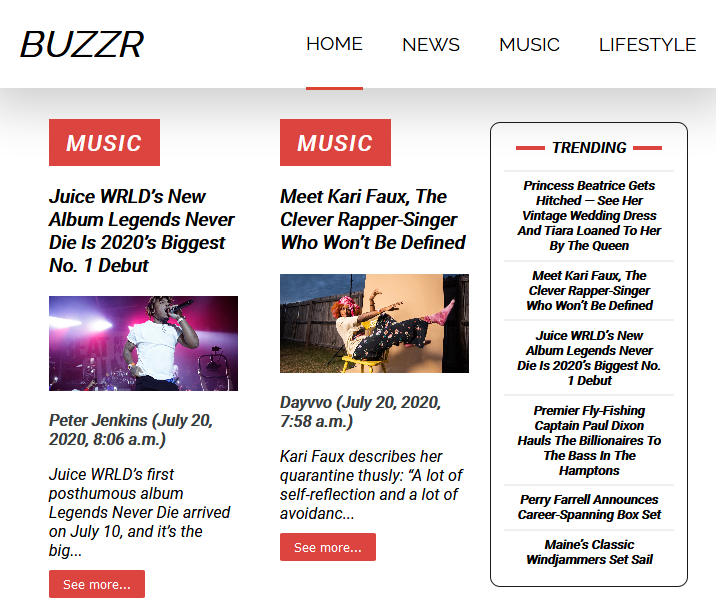

Full Stack Django blog app
features: blog post,blog detail, anonymous user comments with jquery ajax get & post requests, contact us form
live link: www.dayvvo2.pythonanywhere.com
frontend: html,css,js,jquery(ajax)
backend: django 

